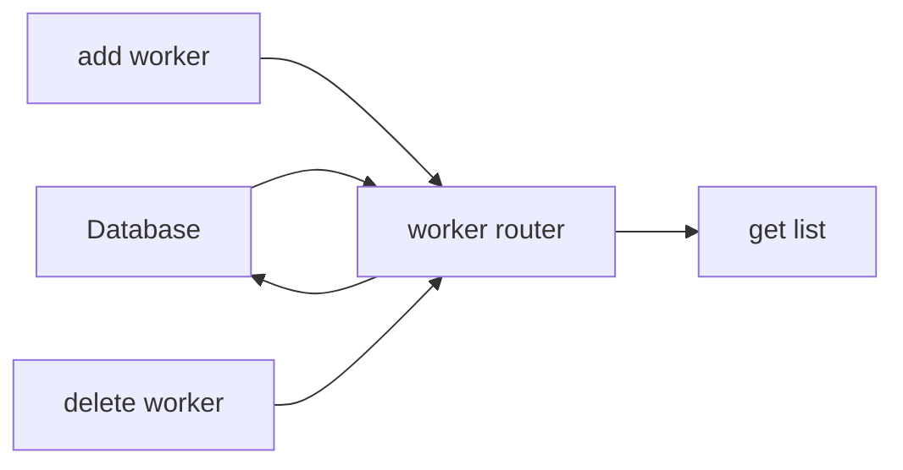
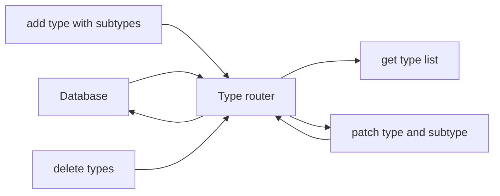
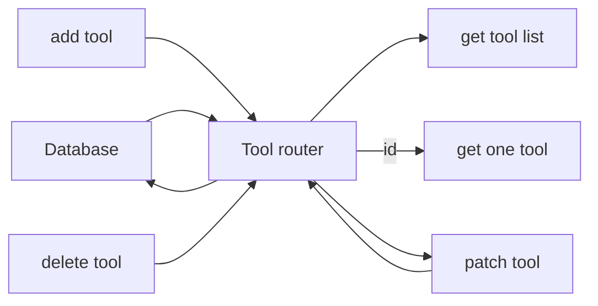
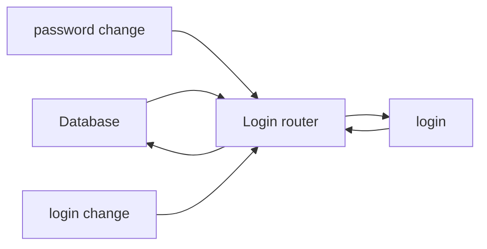
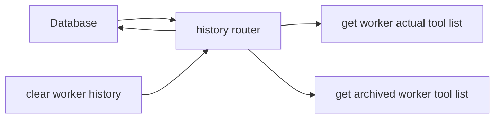

# Tool base backend application

This application is backend part of Tool base service which is responsible for storing information’s about tools in workshop. Forman is able to notice which tool is where and who is actually responsible for it. Additionally he can check a history of each worker. Adding new tool to database simplify storing data’s about it.

## About this app

This app is based on 5 routers which everyone is responsible for handling another type of information:

- Worker router

> responsible for getting list, adding and removing of workers

- Types router

> This router let to add, remove, patch, and delete types and subtypes of tool in database

- Tools router

> Forman can add tool and assigned to type or subtype in base. Also there is a possibility to patch and remove tools, get list of all or get particular tool.

- login router

> user can log in, change password or login

- history router

> With this router you can check for witch tools given worker is responsible now and how it was in the past. Also there is a possibility to clear history of worker.

## Technology stack

This app is a node with express server written using TypeScript. Data are storing in mySql MariaDB database

App contains unit test with Jest.

Additional used modules:

- uuid

- cookie-parser

- mysql2

- bcrypt

- express async errors

## How to start ?

After repository cloning use node package manager to install required modules. In console use command:

- npm install

To start dev server:

- npm run dev

To build production version:

- npm run build

Start build version:

- npm run start

## Contact

To reach author use email: pileckidariusz90@gmail.com

## Copyrights

This app is integral part of Tool base service. All rights for Tool base service are reserved for:

- Techglass.Sp.z o.o.

Using any parts of this repository in commercial are forbidden.